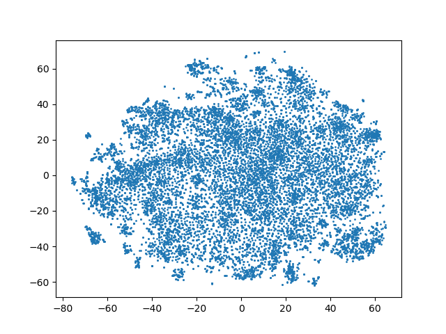
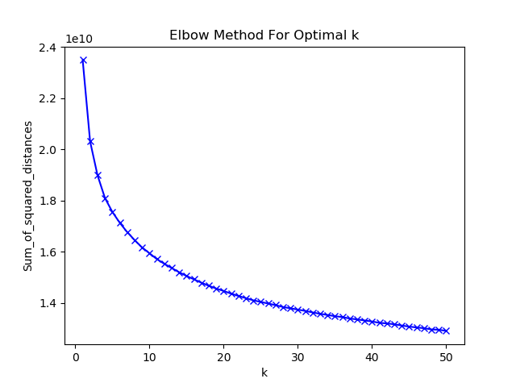
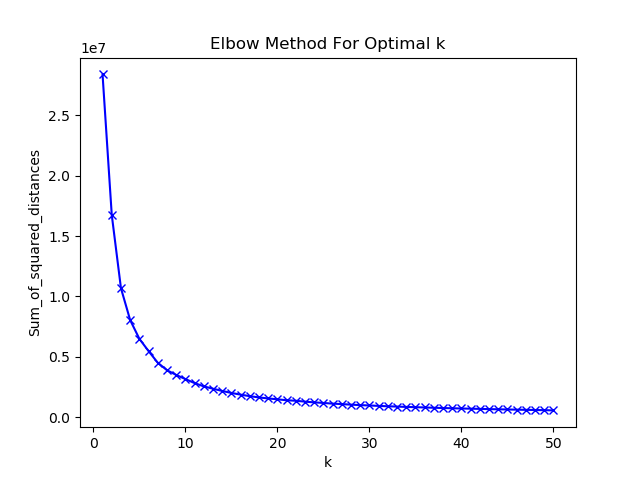
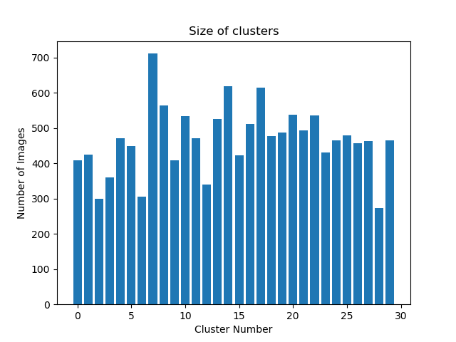

## TSNE

t-Distributed Stochastic Neighbor Embedding (t-SNE) is a (prize-winning) technique for dimensionality reduction

- tsne/tsne.py   
    - ~[Old Source](https://lvdmaaten.github.io/tsne/)~
    - Now using sklearn's inbuilt function

- tsne/prepare-data.py
    - Conform data for tsne script
    - Read every image in train_dir and creates two files
        1. image.txt
            - Each line corresponds to a flattened version of each image (resized to 24x24)
        2. names.txt
            - Each line corresponds to the name of the file

- No benefit. 2D projection shows no clustering at all
    
 
## Clustering

### K-means

- On 24x24 Grayscale Image
    + Find Optimum K  
        

- On 2d-TSNE projection
    + Find Optimum K  
        

- Based on above two plots will do clustering with K=30 and label accordingly.

- Class Distribution after clustering.

    

### DBSCAN 

- On 24x24 Grayscale Image
    + **Failed!!**
    + 3 clusters.
    + 13984 / 14000 points are outliers. :joy:
    ```python
    {   
        -1: 13984, 
        0: 6, 
        1: 5, 
        2: 5
    }
    ```
- On 2d-tsne data
    + Use `eps = 3`
        * 8 clusters with 13812 belonging to just one cateogry. :unamused:
        * Won't make any difference.

    + Use `eps = 1`
        * 643 Cluster :astonished:
